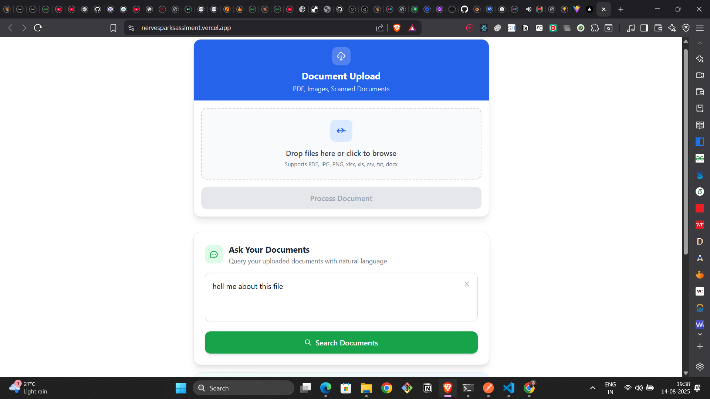
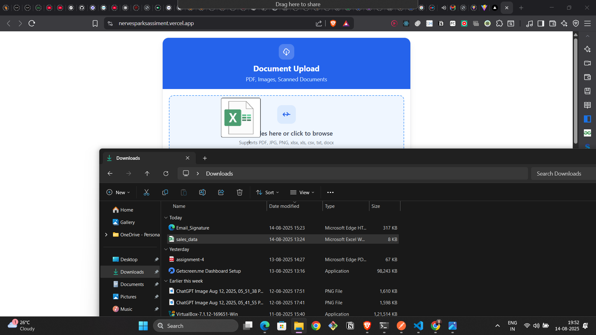
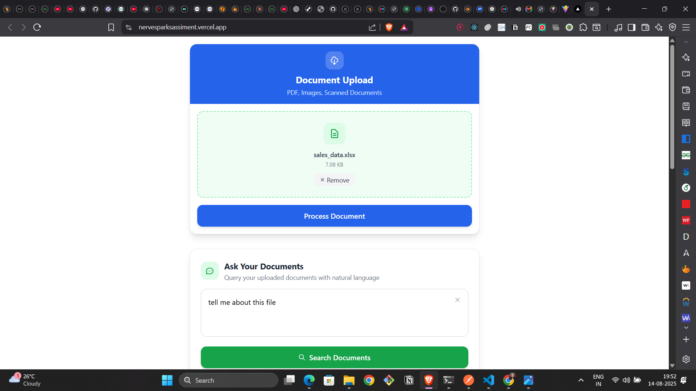
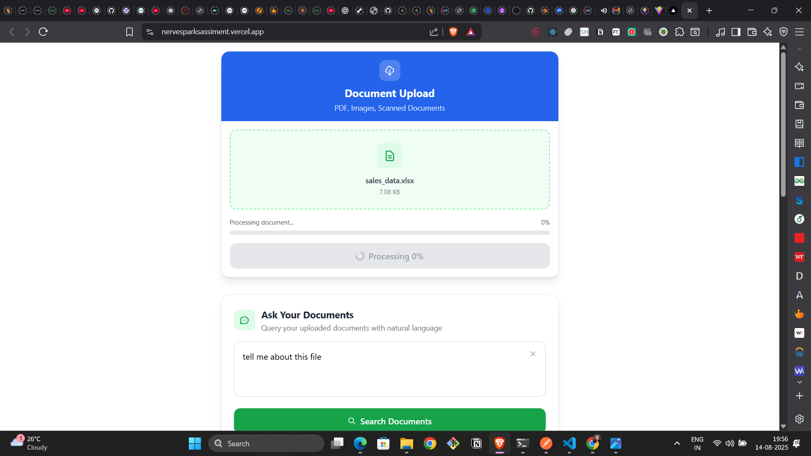

# Document Upload Project

A modern, responsive file upload application built with React that allows users to upload documents with drag-and-drop functionality, real-time progress tracking, and seamless backend integration.


> 📸 **Add your screenshot here**: Replace with actual screenshot of your upload interface

## 📸 Screenshots

### Main Interface


### Drag & Drop in Action



### Upload States
| Empty State | File Selected | Uploading | Success |
|-------------|---------------|-----------|---------|
|  |  |  |  |

## 🌟 Features

### Core Functionality
- **Drag & Drop Upload**: Intuitive drag-and-drop interface for file selection
- **Click to Browse**: Traditional file picker as backup option
- **Real-time Progress**: Visual progress bar with percentage indicator
- **File Preview**: Display selected file name and size before upload
- **Multiple Format Support**: PDF, Images (JPG, PNG), Excel (xlsx, xls), CSV, TXT, DOCX
- **Error Handling**: Comprehensive error handling with user-friendly messages
- **Responsive Design**: Works seamlessly on desktop and mobile devices

### User Experience
- **Modern UI**: Clean, professional interface with smooth animations
- **Visual Feedback**: Color-coded states for different upload phases
- **Loading States**: Spinner and progress indicators during upload
- **Success/Error Messages**: Clear status messages with appropriate icons
- **File Management**: Easy file removal before upload

## 🛠️ Technology Stack

### Frontend
- **React** 18.x - Modern React with Hooks
- **Tailwind CSS** - Utility-first CSS framework for styling
- **JavaScript ES6+** - Modern JavaScript features
- **HTML5 File API** - Native file handling capabilities

### Backend Integration
- **REST API** - Communicates with backend via HTTP requests
- **FormData** - Proper multipart form data handling
- **Fetch API** - Native browser API for HTTP requests
- **Error Boundaries** - Graceful error handling

## 📁 Project Structure

```
document-upload-project/
├── public/
│   ├── index.html
│   └── favicon.ico
├── src/
│   ├── components/
│   │   └── UploadFile.js          # Main upload component
│   ├── styles/
│   │   └── index.css              # Global styles
│   ├── App.js                     # Main application component
│   ├── index.js                   # React DOM entry point
│   └── utils/
│       └── api.js                 # API utility functions (optional)
├── package.json
├── tailwind.config.js
└── README.md
```

## 🚀 Quick Start

### Prerequisites
- Node.js (version 14.x or higher)
- npm or yarn package manager
- Modern web browser with HTML5 support

### Installation

1. **Clone the repository**
```bash
git clone https://github.com/harshitduttshukla/Nervesparksassiment
cd visual-rag-js
```

2. **Install dependencies**
```bash
npm install

```

3. **Install required packages**
```bash
npm install react react-dom
npm install -D tailwindcss postcss autoprefixer
npx tailwindcss init -p
```

4. **Configure Tailwind CSS**

Update `tailwind.config.js`:
```javascript
module.exports = {
  content: [
    "./src/**/*.{js,jsx,ts,tsx}",
  ],
  theme: {
    extend: {},
  },
  plugins: [],
}
```

Add to `src/index.css`:
```css
@tailwind base;
@tailwind components;
@tailwind utilities;
```

5. **Set up environment variables**

Create `.env` file in root directory:
```env
REACT_APP_API_URL=https://nervesparksss.onrender.com
REACT_APP_UPLOAD_ENDPOINT=/ingest
```

6. **Start development server**
```bash
npm start
# or
yarn start
```

Visit `http://localhost:3000` to see the application.

## ⚙️ Configuration

### Backend API Integration

The component is configured to work with your backend API:

```javascript
// Current API endpoint
const API_ENDPOINT = 'https://nervesparksss.onrender.com/ingest';
```

### Supported File Types
- **Documents**: PDF, DOCX, TXT
- **Images**: JPG, JPEG, PNG, GIF
- **Spreadsheets**: XLSX, XLS, CSV
- **Maximum file size**: Depends on your backend configuration

### Customization Options

#### 1. Change API Endpoint
```javascript
// In UploadFile.js, update the fetch URL
const response = await fetch('YOUR_API_ENDPOINT_HERE', {
  method: 'POST',
  body: formData,
});
```

#### 2. Modify File Type Restrictions
```javascript
// Add file type validation in handleFileChange
const allowedTypes = ['application/pdf', 'image/jpeg', 'image/png'];
if (!allowedTypes.includes(selectedFile.type)) {
  setMessage("File type not supported");
  return;
}
```

#### 3. Customize Styling
```javascript
// Modify Tailwind classes in the component
className="bg-blue-600 hover:bg-blue-700 text-white"
```

## 🎨 Component API

### Props (Future Enhancement)
```javascript
<UploadFile
  apiEndpoint="https://your-api.com/upload"
  allowedTypes={['pdf', 'jpg', 'png']}
  maxFileSize={10 * 1024 * 1024} // 10MB
  onUploadSuccess={(response) => console.log('Success:', response)}
  onUploadError={(error) => console.log('Error:', error)}
/>
```

## 🔧 Available Scripts

### Development
```bash
npm start          # Start development server
npm run build      # Build for production
npm test           # Run test suite
npm run lint       # Run ESLint
npm run format     # Format code with Prettier
```

### Production Build
```bash
npm run build
```
Creates optimized production build in the `build/` directory.

## 🚀 Deployment

### Deploy to Vercel (Recommended)
1. Build the project: `npm run build`
2. Install Vercel CLI: `npm i -g vercel`
3. Run: `vercel --prod`
4. Follow the prompts

### Deploy to Netlify
1. Build the project: `npm run build`
2. Drag and drop the `build` folder to [Netlify Drop](https://app.netlify.com/drop)
3. Your site is live!

### Deploy to GitHub Pages
```bash
npm install --save-dev gh-pages

# Add to package.json scripts:
"predeploy": "npm run build",
"deploy": "gh-pages -d build"

# Deploy
npm run deploy
```

### Environment Variables for Production
Set these in your deployment platform:
- `REACT_APP_API_URL`: Your backend API URL
- `REACT_APP_UPLOAD_ENDPOINT`: Upload endpoint path

## 🧪 Testing

### Manual Testing Checklist
- [ ] Drag and drop file upload works
- [ ] Click to browse file selection works
- [ ] Progress bar displays correctly
- [ ] Success message appears after upload
- [ ] Error handling works for failed uploads
- [ ] File removal functionality works
- [ ] Responsive design on mobile devices
- [ ] Multiple file type support

### Automated Testing (Future Enhancement)
```bash
npm test                    # Run all tests
npm run test:coverage      # Run tests with coverage
npm run test:watch         # Run tests in watch mode
```

## 🐛 Troubleshooting

### Common Issues

#### 1. CORS Errors
**Problem**: Browser blocks requests to backend
**Solution**: Configure CORS on your backend server
```javascript
// Express.js example
app.use(cors({
  origin: ['http://localhost:3000', 'https://yourdomain.com']
}));
```

#### 2. File Upload Fails
**Problem**: Files not reaching backend
**Solutions**:
- Check network tab in browser dev tools
- Verify API endpoint is correct
- Check backend logs
- Ensure backend accepts `multipart/form-data`

#### 3. Progress Bar Not Working
**Problem**: Progress stays at 0%
**Solution**: Ensure your API supports progress events or use the built-in simulation

#### 4. Large File Upload Timeout
**Problem**: Large files fail to upload
**Solutions**:
- Increase backend timeout settings
- Implement file chunking
- Add client-side file size validation

### Debug Mode
Enable console logging for debugging:
```javascript
// Add to UploadFile.js
const DEBUG = process.env.NODE_ENV === 'development';
if (DEBUG) console.log('Upload started:', file.name);
```

### Version History
- **v1.0.0** - Initial release with basic upload functionality
- **v1.1.0** - Added drag and drop support
- **v1.2.0** - Improved error handling and user feedback

---

Made with ❤️ for seamless document uploads